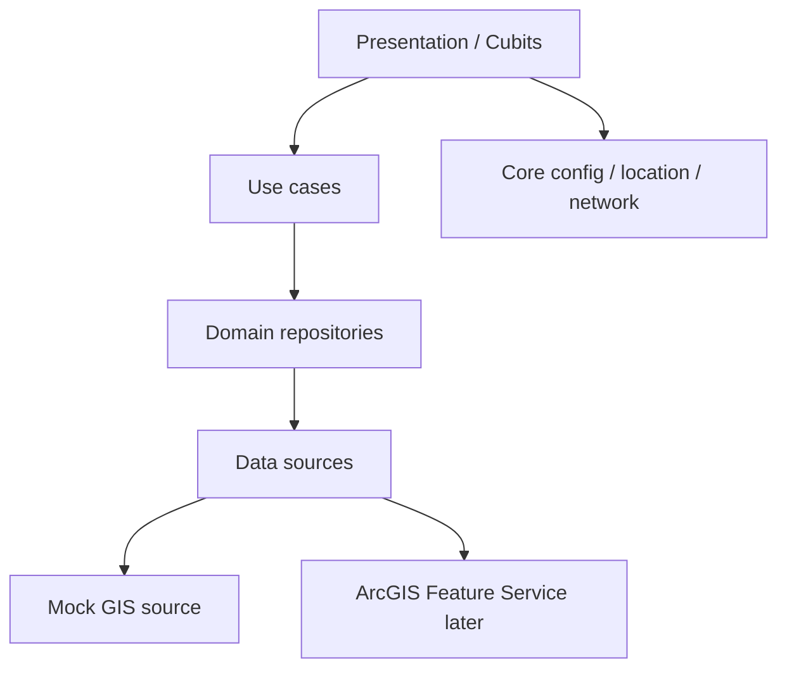

# TransitOps GIS

Transportation & Field Operations — a Flutter demonstration application for enterprise transit GIS workflows using Esri ArcGIS.

This repository is being built in phases. **Phase 1 (current)** establishes architecture, theming, navigation, and configuration. ArcGIS Maps SDK integration starts in Phase 2.

## Overview

TransitOps GIS is a professional field-operations style mobile app (Android and iOS, phone and tablet) intended to demonstrate:

- Flutter Clean Architecture
- BLoC / Cubit state management
- GIS-ready configuration without hardcoded secrets
- Responsive phone / tablet navigation
- A maintainable path to ArcGIS Maps SDK for Flutter

## Architecture

```
Presentation (widgets, Cubits)
        ↓
Domain (entities, repository contracts, use cases)
        ↓
Data (datasources, models, repository implementations)
        ↓
Core (config, errors, network, location, theme, responsive)
```

Dependencies point inward. Widgets do not contain business logic. GIS SDKs will be isolated behind repository and service abstractions so mock data sources can be replaced with ArcGIS Feature Services later.



## Technology Stack

- Flutter 3.35.5 / Dart 3.9.2
- flutter_bloc (Cubit)
- GetIt
- Dio
- Equatable
- ArcGIS Maps SDK for Flutter — **not added yet (Phase 2)**

## Project Structure

```
lib/
├── core/           # config, errors, network, location contract, theme, responsive
├── data/           # datasources, models, repository implementations
├── domain/         # entities, repository contracts, use cases
├── presentation/   # dashboard, map, vehicles, routes, incidents, settings, shell
└── main.dart
```

## Setup

```bash
flutter pub get
```

## ArcGIS API Key Configuration

Phase 1 does not initialize the ArcGIS SDK. Configuration placeholders already exist:

| Dart define | Purpose |
| --- | --- |
| `APP_ENV` | `development` / `staging` / `production` |
| `API_BASE_URL` | Backend base URL |
| `ARCGIS_API_KEY` | Esri API key (leave empty until Phase 2) |
| `ARCGIS_PORTAL_URL` | Portal URL, default `https://www.arcgis.com` |

Example:

```bash
flutter run --dart-define=ARCGIS_API_KEY=YOUR_KEY
```

Never commit real keys. See `.env.example`.

## Running the App

```bash
flutter run
```

Phone layout uses a bottom navigation bar. Width ≥ 840 logical pixels uses a navigation rail (tablet / landscape).

## Testing

```bash
flutter test
flutter analyze
```

## Android Setup

Standard Flutter Android embedding. Application id: `com.transport.TransitOpsGIS.transitops_gis`.

Location permissions will be added in the device-location phase.

## iOS Setup

Display name: TransitOps GIS. Location usage descriptions will be added in the device-location phase.

## Features (planned)

Dashboard → Live GIS map → vehicles / stops / routes / incidents → spatial query → routing → incident reporting → feature editing → offline-ready sync.

## Future Production Architecture

Replace mock GIS datasources with ArcGIS Feature Services, add authenticated portal access, offline map areas, and a synchronization queue. Phase 1 only provides the seams.
