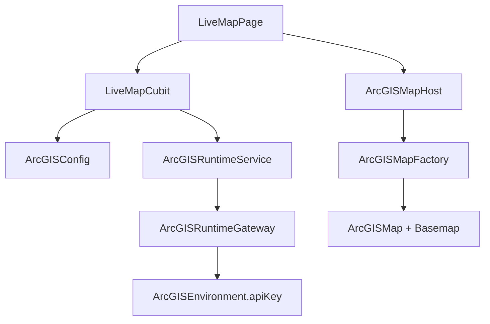

# TransitOps GIS

Transportation & Field Operations — a Flutter demonstration application for enterprise transit GIS workflows using Esri ArcGIS.

This repository is being built in phases. **Phase 4 (current)** is the Live GIS map with ArcGIS feature layers.

## Overview

TransitOps GIS is a professional field-operations style mobile app (Android and iOS, phone and tablet) intended to demonstrate:

- Flutter Clean Architecture
- BLoC / Cubit state management
- ArcGIS Maps SDK for Flutter
- GIS-ready configuration without hardcoded secrets
- Responsive phone / tablet navigation

## Architecture

```
Presentation (widgets, Cubits)
        ↓
Domain (entities, repository contracts, use cases)
        ↓
Data (datasources, models, ArcGIS map factory)
        ↓
Core (config, ArcGIS runtime, errors, network, location, theme)
```

ArcGIS SDK types stay in `core/gis` and `data/gis`. Widgets talk to `LiveMapCubit` and a thin `ArcGISMapHost`.



## Technology Stack

- Flutter 3.35.5 / Dart 3.9.2
- flutter_bloc (Cubit)
- GetIt
- Dio
- Equatable
- **ArcGIS Maps SDK for Flutter `200.8.0+4672`**

### Why 200.8 instead of 300.1

The current pub.dev latest is `300.1`, which requires **Flutter 3.44.1 / Dart 3.12.1**. This project is on Flutter 3.35.5. Esri documents 200.8 as compatible with Flutter 3.35.x. After you upgrade Flutter, we can move to 300.x without changing the config/service architecture.

## ArcGIS Integration

- `ArcGISConfig` holds `apiKey`, `portalUrl`, and `environment`
- `ArcGISRuntimeService` applies the key to `ArcGISEnvironment` at startup
- `ArcGISMapFactory` creates an `ArcGISMap` with a Streets basemap
- Live Map shows a real `ArcGISMapView` only when a key is present
- Without a key, the app stays usable and explains how to configure one

## Setup

```bash
flutter pub get
dart run arcgis_maps install
```

`dart run arcgis_maps install` places native cores under `arcgis_maps_core/` (gitignored). The iOS Podfile points CocoaPods at those local podspecs (`Runtimecore`, `arcgis_maps_ffi`).

## ArcGIS API Key Configuration

**Do not put the key in source.** Provide it at run time.

1. Create an API key in [Esri's developer portal](https://developers.arcgis.com/) with basemap privileges.
2. Copy `dart_defines.example.json` to `dart_defines.json` (gitignored).
3. Paste the key into `ARCGIS_API_KEY`.
4. Run:

```bash
flutter run --no-enable-impeller --dart-define-from-file=dart_defines.json
```

Equivalent:

```bash
flutter run --dart-define=ARCGIS_API_KEY=YOUR_KEY
```

| Dart define | Purpose |
| --- | --- |
| `APP_ENV` | `development` / `staging` / `production` |
| `API_BASE_URL` | Backend base URL |
| `ARCGIS_API_KEY` | Esri API key |
| `ARCGIS_PORTAL_URL` | Portal URL, default `https://www.arcgis.com` |
| `ARCGIS_MAPS_USE_TEXTURE` | `true` — use Esri texture rendering on Android (avoids a blank hybrid platform view) |

## Running the App

```bash
flutter run --no-enable-impeller
```

Phone layout uses a bottom navigation bar. Width ≥ 840 logical pixels uses a navigation rail.

## Testing

```bash
flutter test
flutter analyze
```

ArcGIS runtime is mocked in tests. Widget tests do not require an Esri account.

## Android Setup

- `minSdk` 28
- `compileSdk` 36
- NDK `27.0.12077973`
- ABIs: `arm64-v8a`, `x86_64` (32-bit is not supported by the SDK)
- Permissions: `INTERNET`, `ACCESS_FINE_LOCATION`, `ACCESS_COARSE_LOCATION`

Application id: `com.transport.TransitOpsGIS.transitops_gis`.

## iOS Setup

- Deployment target **17.0**
- Location usage descriptions in `Info.plist`
- `platform :ios, '17.0'` in the Podfile

## Features (planned)

Dashboard → Live GIS map (basemap in Phase 2) → vehicles / stops / routes / incidents → spatial query → routing → incident reporting → feature editing → offline-ready sync.

## Future Production Architecture

Replace mock GIS datasources with ArcGIS Feature Services, add authenticated portal access, offline map areas, and a synchronization queue.
